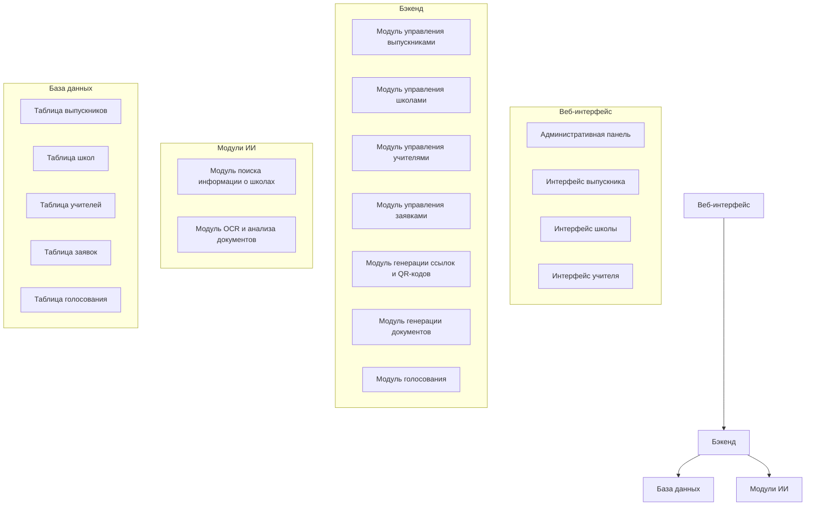

# Архитектура системы сбора информации о выпускниках и учителях

## Общее описание

Система предназначена для сбора и сопоставления данных выпускников и учителей в школе. Основная цель - собрать информацию о школах, в которых учились выпускники, учителях, которые там работали, и предоставить выпускникам возможность голосовать за учителей.

## Ключевые характеристики системы

- **Объем данных**: ~200 выпускников, ~1000 учителей
- **Одновременных пользователей**: до 10
- **Безопасность**: аутентификация по уникальным ссылкам, кроме администратора
- **Языки интерфейса**: только русский
- **Интеграции**: внешние интеграции не требуются, кроме поиска информации через API

## Архитектура системы



## Технологический стек

- **Веб-фреймворк**: Flask
- **База данных**: SQLite
- **ORM**: Flask-SQLAlchemy
- **Аутентификация**: Flask-Login
- **Формы**: Flask-WTF
- **Административный интерфейс**: Flask-Admin
- **Генерация QR-кодов**: qrcode
- **Работа с документами**: python-docx
- **OCR**: PyPDF2 или pdfplumber
- **ИИ**: LangChain с OpenAI API
- **Поиск информации**: Tavily API

## Структура проекта

```
/
├── app.py                      # Основной файл приложения
├── config.py                   # Конфигурация приложения
├── requirements.txt            # Зависимости проекта
├── static/                     # Статические файлы
│   ├── css/                    # CSS стили
│   ├── js/                     # JavaScript файлы
│   ├── img/                    # Изображения
│   ├── qr/                     # Сгенерированные QR-коды
│   └── documents/              # Сгенерированные документы
├── templates/                  # HTML шаблоны
│   ├── admin/                  # Шаблоны для административной панели
│   ├── graduate/               # Шаблоны для выпускников
│   ├── school/                 # Шаблоны для школ
│   └── teacher/                # Шаблоны для учителей
├── models/                     # Модели данных
│   ├── __init__.py
│   ├── graduate.py             # Модель выпускника
│   ├── school.py               # Модель школы
│   ├── teacher.py              # Модель учителя
│   └── application.py          # Модель заявки
├── controllers/                # Контроллеры
│   ├── __init__.py
│   ├── admin_controller.py     # Контроллер для административной панели
│   ├── graduate_controller.py  # Контроллер для выпускников
│   ├── school_controller.py    # Контроллер для школ
│   └── teacher_controller.py   # Контроллер для учителей
├── services/                   # Сервисы
│   ├── __init__.py
│   ├── link_service.py         # Сервис для генерации ссылок
│   ├── qr_service.py           # Сервис для генерации QR-кодов
│   ├── document_service.py     # Сервис для генерации документов
│   └── voting_service.py       # Сервис для голосования
├── ai/                         # Модули ИИ
│   ├── __init__.py
│   ├── llm_search_school.py    # Модуль для поиска информации о школах
│   └── document_analyzer.py    # Модуль для анализа документов
└── utils/                      # Утилиты
    ├── __init__.py
    ├── auth.py                 # Утилиты для аутентификации
    ├── validators.py           # Валидаторы
    └── helpers.py              # Вспомогательные функции
```

## Модели данных

### Модель выпускника (Graduate)

```python
class Graduate(db.Model):
    id = db.Column(db.Integer, primary_key=True)
    full_name = db.Column(db.String(255), nullable=False)
    link_token = db.Column(db.String(64), unique=True, nullable=False)
    created_at = db.Column(db.DateTime, default=datetime.utcnow)
    
    # Отношения
    schools = db.relationship('GraduateSchool', back_populates='graduate')
    votes = db.relationship('Vote', back_populates='graduate')
    applications = db.relationship('Application', back_populates='graduate')
```

### Модель школы (School)

```python
class School(db.Model):
    id = db.Column(db.Integer, primary_key=True)
    name = db.Column(db.String(255), nullable=False)
    full_name = db.Column(db.String(512))
    address = db.Column(db.String(512))
    inn = db.Column(db.String(12))
    director = db.Column(db.String(255))
    email = db.Column(db.String(255))
    status = db.Column(db.String(50))  # 'действующая' или 'ликвидирована'
    successor_id = db.Column(db.Integer, db.ForeignKey('school.id'), nullable=True)
    
    # Отношения
    successor = db.relationship('School', remote_side=[id])
    graduate_schools = db.relationship('GraduateSchool', back_populates='school')
    teacher_schools = db.relationship('TeacherSchool', back_populates='school')
    applications = db.relationship('Application', back_populates='school')
```

### Модель учителя (Teacher)

```python
class Teacher(db.Model):
    id = db.Column(db.Integer, primary_key=True)
    full_name = db.Column(db.String(255), nullable=False)
    link_token = db.Column(db.String(64), unique=True, nullable=True)
    document_path = db.Column(db.String(512))  # Путь к подтверждающему документу
    verification_score = db.Column(db.Float)  # Вероятность соответствия (0-1)
    created_at = db.Column(db.DateTime, default=datetime.utcnow)
    
    # Отношения
    schools = db.relationship('TeacherSchool', back_populates='teacher')
    votes = db.relationship('Vote', back_populates='teacher')
```

### Модель заявки (Application)

```python
class Application(db.Model):
    id = db.Column(db.Integer, primary_key=True)
    graduate_id = db.Column(db.Integer, db.ForeignKey('graduate.id'), nullable=False)
    school_id = db.Column(db.Integer, db.ForeignKey('school.id'), nullable=False)
    start_year = db.Column(db.Integer, nullable=False)
    end_year = db.Column(db.Integer, nullable=False)
    start_grade = db.Column(db.Integer, nullable=False)
    end_grade = db.Column(db.Integer, nullable=False)
    school_link_token = db.Column(db.String(64), unique=True, nullable=False)
    teacher_link_token = db.Column(db.String(64), unique=True, nullable=False)
    document_path = db.Column(db.String(512))  # Путь к сгенерированному письму
    status = db.Column(db.String(50), default='created')  # created, sent, completed
    created_at = db.Column(db.DateTime, default=datetime.utcnow)
    
    # Отношения
    graduate = db.relationship('Graduate', back_populates='applications')
    school = db.relationship('School', back_populates='applications')
```

### Связующие таблицы

```python
class GraduateSchool(db.Model):
    id = db.Column(db.Integer, primary_key=True)
    graduate_id = db.Column(db.Integer, db.ForeignKey('graduate.id'), nullable=False)
    school_id = db.Column(db.Integer, db.ForeignKey('school.id'), nullable=False)
    start_year = db.Column(db.Integer, nullable=False)
    end_year = db.Column(db.Integer, nullable=False)
    start_grade = db.Column(db.Integer, nullable=False)
    end_grade = db.Column(db.Integer, nullable=False)
    is_confirmed = db.Column(db.Boolean, default=False, nullable=False)  # Статус подтверждения связки выпускник-школа
    
    # Отношения
    graduate = db.relationship('Graduate', back_populates='schools')
    school = db.relationship('School', back_populates='graduate_schools')

class TeacherSchool(db.Model):
    id = db.Column(db.Integer, primary_key=True)
    teacher_id = db.Column(db.Integer, db.ForeignKey('teacher.id'), nullable=False)
    school_id = db.Column(db.Integer, db.ForeignKey('school.id'), nullable=False)
    start_year = db.Column(db.Integer, nullable=False)
    end_year = db.Column(db.Integer, nullable=False)
    subjects = db.Column(db.String(512))  # Предметы через запятую
    is_confirmed = db.Column(db.Boolean, default=False, nullable=False)  # Статус подтверждения связки учитель-школа
    
    # Отношения
    teacher = db.relationship('Teacher', back_populates='schools')
    school = db.relationship('School', back_populates='teacher_schools')

class Vote(db.Model):
    id = db.Column(db.Integer, primary_key=True)
    graduate_id = db.Column(db.Integer, db.ForeignKey('graduate.id'), nullable=False)
    teacher_id = db.Column(db.Integer, db.ForeignKey('teacher.id'), nullable=False)
    created_at = db.Column(db.DateTime, default=datetime.utcnow)
    
    # Отношения
    graduate = db.relationship('Graduate', back_populates='votes')
    teacher = db.relationship('Teacher', back_populates='votes')
```

## Основные модули системы

### Модуль управления выпускниками

```python
class GraduateService:
    def create_graduate(self, full_name):
        """Создание нового выпускника и генерация уникальной ссылки"""
        
    def get_graduate_by_token(self, token):
        """Получение выпускника по токену ссылки"""
        
    def update_graduate_schools(self, graduate_id, school_data):
        """Обновление информации о школах выпускника"""
        
    def vote_for_teachers(self, graduate_id, teacher_ids):
        """Голосование выпускника за учителей"""
```

### Модуль управления школами

```python
class SchoolService:
    def search_school(self, city, name):
        """Поиск информации о школе через ИИ"""
        
    def create_or_update_school(self, school_data):
        """Создание или обновление информации о школе"""
        
    def get_school_by_id(self, school_id):
        """Получение школы по ID"""
        
    def get_school_teachers(self, school_id, start_year, end_year):
        """Получение учителей, работавших в школе в указанный период"""
```

### Модуль управления учителями

```python
class TeacherService:
    def create_teacher(self, teacher_data):
        """Создание нового учителя"""
        
    def get_teacher_by_token(self, token):
        """Получение учителя по токену ссылки"""
        
    def update_teacher_schools(self, teacher_id, school_data):
        """Обновление информации о школах учителя"""
        
    def upload_document(self, teacher_id, document):
        """Загрузка подтверждающего документа"""
        
    def verify_document(self, teacher_id):
        """Проверка документа с помощью ИИ"""
        
    def get_top_teachers(self, limit=10):
        """Получение топ учителей по количеству голосов"""
```

### Модуль управления заявками

```python
class ApplicationService:
    def create_application(self, graduate_id, school_id, period_data):
        """Создание новой заявки"""
        
    def generate_links(self, application_id):
        """Генерация ссылок для школы и учителей"""
        
    def generate_document(self, application_id):
        """Генерация письма запроса"""
        
    def update_status(self, application_id, status):
        """Обновление статуса заявки"""
        
    def get_application_by_token(self, token):
        """Получение заявки по токену ссылки"""
```

### Модуль генерации ссылок и QR-кодов

```python
class LinkService:
    def generate_token(self, length=32):
        """Генерация уникального токена для ссылки"""
        
    def generate_graduate_link(self, graduate_id):
        """Генерация ссылки для выпускника"""
        
    def generate_school_link(self, application_id):
        """Генерация ссылки для школы"""
        
    def generate_teacher_link(self, application_id):
        """Генерация ссылки для учителей"""
        
    def generate_qr_code(self, url):
        """Генерация QR-кода для ссылки"""
```

### Модуль генерации документов

```python
class DocumentService:
    def generate_school_request(self, application_id):
        """Генерация письма запроса в школу"""
        
    def save_document(self, document, filename):
        """Сохранение документа на сервере"""
        
    def get_document_path(self, filename):
        """Получение пути к документу"""
```

### Модуль OCR и анализа документов

```python
class DocumentAnalyzer:
    def extract_text_from_pdf(self, pdf_path):
        """Извлечение текста из PDF документа"""
        
    def analyze_document(self, text, teacher_data):
        """Анализ документа с помощью LLM"""
        
    def calculate_verification_score(self, analysis_result, teacher_data):
        """Расчет вероятности соответствия"""
```

## Маршруты API

### Маршруты для административной панели

```python
@app.route('/admin/graduates', methods=['GET', 'POST'])
def admin_graduates():
    """Управление выпускниками"""
    
@app.route('/admin/graduates/<int:id>/link', methods=['GET'])
def admin_graduate_link(id):
    """Получение ссылки для выпускника"""
    
@app.route('/admin/applications', methods=['GET'])
def admin_applications():
    """Просмотр всех заявок"""
    
@app.route('/admin/applications/<int:id>', methods=['GET', 'POST'])
def admin_application_detail(id):
    """Просмотр и редактирование заявки"""
    
@app.route('/admin/applications/<int:id>/document', methods=['GET', 'POST'])
def admin_application_document(id):
    """Генерация и редактирование письма запроса"""
```

### Маршруты для выпускников

```python
@app.route('/graduate/<token>', methods=['GET', 'POST'])
def graduate_form(token):
    """Форма для заполнения информации о школе"""
    
@app.route('/graduate/<token>/vote', methods=['GET', 'POST'])
def graduate_vote(token):
    """Голосование за учителей"""
```

### Маршруты для школ

```python
@app.route('/school/<token>', methods=['GET', 'POST'])
def school_form(token):
    """Форма для заполнения информации об учителях"""
```

### Маршруты для учителей

```python
@app.route('/teacher/<token>', methods=['GET', 'POST'])
def teacher_form(token):
    """Форма для заполнения информации о местах работы"""
    
@app.route('/teacher/<token>/document', methods=['POST'])
def teacher_document(token):
    """Загрузка подтверждающего документа"""
```

## Интеграция с ИИ

### Поиск информации о школах

Для поиска информации о школах будем использовать уже реализованный модуль `llm_search_school.py`, который использует LangChain и Tavily Search API.

### Анализ документов

Для анализа документов будет реализован новый модуль, который будет:
1. Извлекать текст из PDF документов с помощью библиотеки PyPDF2 или pdfplumber
2. Анализировать текст с помощью LLM для извлечения информации о местах работы
3. Сравнивать извлеченную информацию с указанными школами
4. Рассчитывать вероятность соответствия

```python
def analyze_document(document_path, teacher_data):
    # Извлечение текста из PDF
    text = extract_text_from_pdf(document_path)
    
    # Формирование запроса к LLM
    prompt = f"""
    Проанализируй следующий документ и извлеки информацию о местах работы.
    
    Документ:
    {text}
    
    Учитель указал следующие места работы:
    {teacher_data}
    
    Извлеки из документа все места работы в формате:
    1. Название организации, период работы, должность
    2. ...
    
    Затем сравни с указанными учителем местами работы и оцени вероятность соответствия от 0 до 1.
    """
    
    # Вызов LLM
    response = llm.invoke(prompt)
    
    # Парсинг ответа и расчет вероятности
    # ...
    
    return verification_score
```

## Безопасность

Для обеспечения безопасности системы будут реализованы следующие меры:

1. Генерация уникальных токенов для ссылок с использованием криптографически стойких алгоритмов
2. Проверка токенов при каждом запросе
3. Ограничение доступа к данным в зависимости от роли пользователя
4. Валидация всех входных данных
5. Защита от CSRF-атак с использованием Flask-WTF
6. Логирование всех действий пользователей

## Особенности подтверждения связей выпускник-школа и учитель-школа

- Для каждой связки выпускник-школа (GraduateSchool) и учитель-школа (TeacherSchool) реализовано поле is_confirmed, отражающее статус подтверждения.
- Изменение статуса подтверждения осуществляется через POST-запросы с передачей параметров id/link_id и link_type.
- Контроллеры при формировании данных для шаблонов явно добавляют поле is_confirmed для каждой заявки, чтобы интерфейс мог корректно отображать состояние кнопки ("Подтвердить"/"Отменить").
- Это обеспечивает единообразную и предсказуемую работу интерфейса для всех типов связей.

## Дополнительные компоненты

### Генерация QR-кодов

Для генерации QR-кодов будет использоваться библиотека qrcode:

```python
import qrcode

def generate_qr_code(url, filename):
    qr = qrcode.QRCode(
        version=1,
        error_correction=qrcode.constants.ERROR_CORRECT_L,
        box_size=10,
        border=4,
    )
    qr.add_data(url)
    qr.make(fit=True)
    
    img = qr.make_image(fill_color="black", back_color="white")
    img.save(f"static/qr/{filename}.png")
    
    return f"static/qr/{filename}.png"
```

### Генерация документов

Для генерации документов в формате Word будет использоваться библиотека python-docx:

```python
from docx import Document
from docx.shared import Pt

def generate_school_request(application, school, graduate):
    doc = Document()
    
    # Добавление заголовка
    doc.add_heading('Запрос информации', 0)
    
    # Добавление текста
    p = doc.add_paragraph(f'Уважаемый руководитель {school.full_name}!')
    p.add_run('\n\nПросим Вас предоставить информацию об учителях, работавших в Вашей школе ')
    p.add_run(f'в период с {application.start_year} по {application.end_year} год.')
    
    # Добавление информации о выпускнике
    doc.add_paragraph(f'Запрос сформирован для выпускника: {graduate.full_name}')
    
    # Добавление ссылки для заполнения информации
    p = doc.add_paragraph('Для заполнения информации перейдите по ссылке: ')
    p.add_run(f'http://example.com/school/{application.school_link_token}')
    
    # Сохранение документа
    filename = f'request_{application.id}.docx'
    doc.save(f'static/documents/{filename}')
    
    return f'static/documents/{filename}'
```

## Этапы реализации проекта

Предлагаются следующие этапы реализации проекта:

1. **Этап 1: Настройка базовой структуры проекта**
   - Создание структуры каталогов
   - Настройка Flask и расширений
   - Создание моделей данных и миграций

2. **Этап 2: Реализация административной панели**
   - Создание интерфейса для управления выпускниками
   - Реализация генерации ссылок для выпускников
   - Реализация просмотра и управления заявками

3. **Этап 3: Реализация интерфейса для выпускников**
   - Создание формы для заполнения информации о школе
   - Интеграция с модулем поиска информации о школах
   - Реализация формирования заявок

4. **Этап 4: Реализация генерации документов и QR-кодов**
   - Реализация генерации ссылок для школ и учителей
   - Реализация генерации QR-кодов
   - Реализация генерации писем запросов

5. **Этап 5: Реализация интерфейса для школ и учителей**
   - Создание формы для заполнения информации школами
   - Создание формы для заполнения информации учителями
   - Реализация загрузки и проверки документов

6. **Этап 6: Реализация голосования и ранжирования**
   - Создание интерфейса для голосования выпускников за учителей
   - Реализация ранжирования учителей по количеству голосов
   - Создание отчетов и статистики

7. **Этап 7: Тестирование и оптимизация**
   - Модульное тестирование основных компонентов
   - Интеграционное тестирование
   - Оптимизация производительности